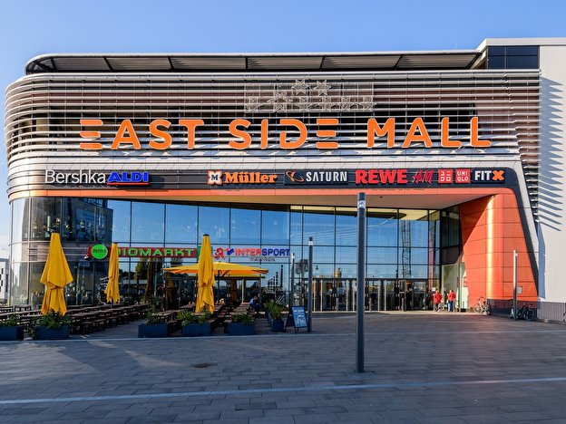

# Gentrification of Berlin

Project to identify areas of Berlin that will be gentrified next



*Boooooo*

## Setup

```bash
pip install -r requirements.txt
```


## Data processing

Raw data is `.xls` in `./data` (where did it come from originally?)

From `data/*.xls` to `dataframes/*.pkl` is done in:

- [PLZ](https://github.com/ninathumser/Gentrification/blob/master/PLZ.ipynb)
- [Area](https://github.com/ninathumser/Gentrification/blob/master/Area.ipynb)
- [Rent](https://github.com/ninathumser/Gentrification/blob/master/Rent.ipynb)
- [Pop_Migration](https://github.com/ninathumser/Gentrification/blob/master/Pop_Migration.ipynb)
- [Pop_Age](https://github.com/ninathumser/Gentrification/blob/master/Pop_Age.ipynb)

The above notebooks do basic data cleaning (dropping of rows with nulls) - maybe more.

These are then combined in [Combining_Dataframes](https://github.com/ninathumser/Gentrification/blob/master/Combining_Dataframes.ipynb) to generate `dataframes/final_all.pkl`.  This notebook does 

- heaiver data cleaning (imputing missing values)
- feature engineering (one step lag, frequency encoding)
